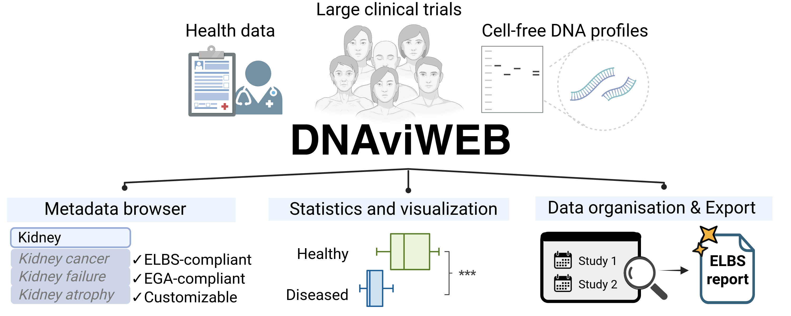

# DNAviWEB

DNAviWEB (https://dnavi.sc.hpi.de/) is a freely-accessible implementation of the DNAvi analysis tool for instant pre-sequencing screening of cell-free DNA fragmentomics from electrophoresis traces.

## 1. Description





**DNAvi**, the core program implemented in DNAviWEB, is a command-line tool designed to analyze and visualize cell-free DNA fragmentation profiles from liquid biopsies. More information is available on the [official GitHub repository](https://github.com/anjahess/DNAvi).  

**DNAviWEB** builds on DNAvi by providing a web-based interface hosted on Hasso Plattner Institute servers. It allows users to:  

- Run DNAvi analyses through a web interface without installing software locally.  
- Store results and metadata in a database.  
- Monitor submissions and track project data through a submission dashboard. 
- Fill in metadata fields automatically with autocomplete functionality, ensuring compliance with EGA (European Genome-phenome Archive) and ELBS recommendations.  

## 2. DNAviWEB Architecture

DNAviWEB is hosted on three virtual machines (VMs) on the Hasso Plattner Institute servers:

- **VM_1**: Responsible for data storage, including PostgreSQL database and the file system.  
- **VM_2**: Hosts the DNAvi Flask application.  
- **VM_3**: Runs pgAdmin for database administration and management.  

## 3. Structure

The web server repo has the following structure:
```
tree -L 2
├── client             <--- contains all scripts for the interface
├── database           <--- contains the database schema
├── docu               <--- internal documentation and READMEs
├── lib                <--- home of DNAvi CLI tool
├── scripts            <--- service and cron job scripts
├── .gitignore         <--- files and folders to be ignored by git
├── dnavi_template.py  <--- template for web services access
├── LICENSE            <--- license file
├── README.md          <--- THIS file
├── requirements.txt   <--- Python dependencies for the project install with `pip install -r requirements.txt`
└── wsgi.py            <--- main python script exposing client/app.py to Gunicorn
```

### 3.1. Client directory


The **client** directory contains the main python file with the **Flask WSGI web application**.
```
cd client && tree -L 1
├── log            <--- log file dir, saves DNAvi command line output and connection to vm1 logs
├── src            <--- scripts used by app.py
├── static         <--- static files (img, css..) for the web interface
├── templates      <--- html templates
├── app.py         <--- python script initiating the app instance
└── db_utils.py    <--- python script for data saving into database and file system of vm_1

```

### 3.2. Database directory


The **database** directory handles the database schema and configuration
```
├── schema         <--- tables, columns, and database schema definitions
├── config.py      <--- config script how to connect to the database
└── create_db.py   <--- script to create the database tables

```

## 4. Authors and Acknowledgment

Original work performed by [Anja Hess](https://github.com/anjahess) and [Yara Matani](https://github.com/yaramt).
Special thanks to Eliz Karaman and other testers.

## 5. Citation

**Anja Hess<sup>1,2,3</sup>, Yara Matani<sup>4</sup>, Dominik Seelow<sup>1</sup>, and Helene Kretzmer<sup>2,4</sup>: 
DNAviWEB: sequencing-free clinical analysis of cell-free DNA profiles (2025).**
1. [Center of Genomic Medicine](https://www.bihealth.org/de/forschung/sektionen/exploratory-diagnostic-sciences-eds/center-of-genomic-medicine), Berlin Institute of Health at Charité Universitätsmedizin Berlin, Berlin, Germany
2. [Max Planck Institute for Molecular Genetics](https://www.molgen.mpg.de/), Berlin, Germany
3. [Department of Biology, Chemistry and Pharmacy](https://www.bcp.fu-berlin.de/), Freie Universität Berlin, Berlin, Germany
4. [Digital Health Cluster](https://hpi.de/forschung/cluster/digital-health/), Hasso Plattner Institute for Digital Engineering, Digital Engineering Faculty, University of Potsdam, Potsdam, Germany


## 6. License
[GNU GPLv3](https://gitlab.hpi.de/dnavi/dnavi_webserver/-/blob/main/LICENSE).  
